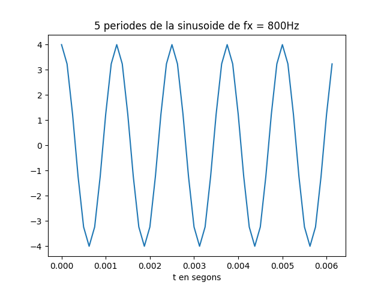
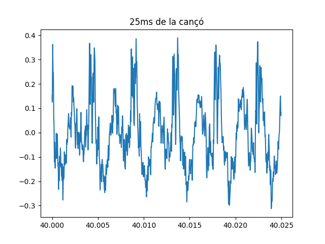
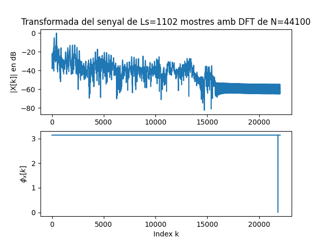

Primera tasca APA 2023: Anàlisi fitxer de so
============================================

## Nom i cognoms: Pau Perálvarez Casasampere


## Representació temporal i freqüencial de senyals d'àudio.

### Domini temporal

Per llegir, escriure i representar un fitxer en format `*.wav` en python podem fem servir els següents mòduls:

- Numpy:
```python
import numpy as np
```
- Matplotlib: 
```python
import matplotlib.pyplot as plt
```
- Soundfile:
```python
import soundfile as sf
```

Per **crear** i **guardar** a un fitxer un senyal sinusoidal de freqüència `fx Hz`, digitalitzat a `fm Hz`, de durada `T` segons i amplitud 
`A` fem:

```python
T= 2.5                               # Durada de T segons
fm=8000                              # Freqüència de mostratge en Hz
fx=440                               # Freqüència de la sinusoide
A=4                                  # Amplitud de la sinusoide
pi=np.pi                             # Valor del número pi
L = int(fm * T)                      # Nombre de mostres del senyal digital
Tm=1/fm                              # Període de mostratge
t=Tm*np.arange(L)                    # Vector amb els valors de la variable temporal, de 0 a T
x = A * np.cos(2 * pi * fx * t)      # Senyal sinusoidal
sf.write('so_exemple1.wav', x, fm)   # Escriptura del senyal a un fitxer en format wav
```

El resultat és un fitxer guardat al directori de treball i que es pot reproduir amb qualsevol reproductor d'àudio

Per **representar** gràficament 5 períodes de senyal fem:

```python
Tx=1/fx                                   # Període del senyal
Ls=int(fm*5*Tx)                           # Nombre de mostres corresponents a 5 períodes de la sinusoide

plt.figure(0)                             # Nova figura
plt.plot(t[0:Ls], x[0:Ls])                # Representació del senyal en funció del temps
plt.xlabel('t en segons')                 # Etiqueta eix temporal
plt.title('5 periodes de la sinusoide')   # Títol del gràfic
plt.show()                                # Visualització de l'objecte gràfic. 
```

El resultat del gràfic és:


> Nota: Si es treballa amb ipython, es pot escriure %matplotlib i no cal posar el plt.show() per veure gràfics

El senyal es pot **escoltar (reproduir)** directament des de python important un entorn de treball amb els dispositius de so, com per 
exemple `sounddevice`:

```python
import sounddevice as sd      # Importem el mòdul sounddevice per accedir a la tarja de so
sd.play(x, fm)                # Reproducció d'àudio
```

### Domini transformat

Domini transformat. Els senyals es poden analitzar en freqüència fent servir la Transformada Discreta de Fourier. 

La funció que incorpora el paquet `numpy` al submòdul `fft` és `fft`:

```python
from numpy.fft import fft     # Importem la funció fft
N=5000                        # Dimensió de la transformada discreta
X=fft(x[0 : Ls], N)           # Càlcul de la transformada de 5 períodes de la sinusoide
```

I podem representar el mòdul i la fase, en funció de la posició de cada valor amb:

```python
k=np.arange(N)                        # Vector amb els valors 0≤  k<N

plt.figure(1)                         # Nova figura
plt.subplot(211)                      # Espai per representar el mòdul
plt.plot(k,abs(X))                    # Representació del mòdul de la transformada
plt.title(f'Transformada del senyal de Ls={Ls} mostres amb DFT de N={N}')   # Etiqueta del títol
plt.ylabel('|X[k]|')                  # Etiqueta de mòdul
plt.subplot(212)                      # Espai per representar la fase
plt.plot(k,np.unwrap(np.angle(X)))    # Representació de la fase de la transformad, desenroscada
plt.xlabel('Index k')                 # Etiqueta de l'eix d'abscisses 
plt.ylabel('$\phi_x[k]$')             # Etiqueta de la fase en Latex
plt.show()                            # Per mostrar els grafics
```


Proves i exercicis a fer i entregar
-----------------------------------

**1. Reprodueix l'exemple fent servir diferents freqüències per la sinusoide. Al menys considera $f_x = 4$ kHz, a banda d'una
    freqüència pròpia en el marge audible. Comenta els resultats.**

La primera freqüència que s'ha fet servir per la sinusoide és de 800Hz. La representació de 5 períodes és la següent:


La representació del mòdul i de la fase de la seva transformada de Fourier és:
 

Podem escoltar ('so_exemple1.wav') que és un to greu.

La segona freqüència que s'ha fet servir per la sinusoide és de 4Khz. La representació de 5 períodes és la següent:


La representació del mòdul i de la fase de la seva transformada de Fourier és:
 

Podem escoltar ('so_exemple2.wav') que és un to molt més agut que l'anterior.
<p>
Si comparem les dues gràfiques veiem que per la sinusoide de 800Hz, els 5 periodes tenen una durada de uns 6ms aproximadament, mentre que per la sinusoide de 4kHz, al ser una freqüència més gran, els 5 períodes tarden casi 12ms. 
Pel cas de les transformades de fourier podem veure que per la primera sinusoide tenim 50 mostres mentre que per la de 4kHz tenim només 10 mostres.

</p>


**2. Modifica el programa per considerar com a senyal a analitzar el senyal del fitxer wav que has creat 
    (`x_r, fm = sf.read('nom_fitxer.wav')`).**

Per tal de trobar la freqüència del sinus fem el següent:

x_r, fm = sf.read('so_exemple2.wav')      #Agafem el fitxer creat abans de freq = 4kHz

```python
#Per trobar fx:
plt.figure(4)
plt.xlabel('Hz')
ms = plt.magnitude_spectrum(x_r, fm) 
fx = ms[1][np.argmax(ms[0])] 
print(f'La freqüència fonamental del senyal: {fx} Hz')
plt.show()
```

Gràcies a aquest tros de codi aconseguim una gràfica on veiem la freqüencia del senyal com un pic (energia màxima). En aquest cas veiem que la freqüència està a 4kHz, ja que és la segona senyal del cas anterior:

 

   - Insereix a continuació una gràfica que mostri 5 períodes del senyal i la seva transformada.

La gràfica dels 5 períodes és:


La gràfica de la transformada:


    - Explica el resultat del apartat anterior.

Veiem que, al utilitzar la mateixa freqüència que el cas anterior (fk = 4kHz), les gràfiques són les mateixes. 


**3.Modifica el programa per representar el mòdul de la Transformada de Fourier en dB i l'eix d'abscisses en el marge de
    $0$ a $f_m/2$ en Hz.**

    - Comprova que la mesura de freqüència es correspon amb la freqüència de la sinusoide que has fet servir.

    - Com pots identificar l'amplitud de la sinusoide a partir de la representació de la transformada?
      Comprova-ho amb el senyal generat.


> NOTES:
>
> - Per representar en dB has de fer servir la fórmula següent:
>
> $X_{dB}(f) = 20\log_{10}\left(\frac{\left|X(f)\right|}{\max(\left|X(f)\right|}\right)$
>
> - La relació entre els valors de l'índex k i la freqüència en Hz és:
>
> $f_k = \frac{k}{N} f_m$

<p>
Utilitzant el mateix codi que per el apartat anterior comprovem que la freqüència és la corresponent:
 

En aquest cas veiem que és de 800Hz (freqüència amb l'amplitud més gran), i també que apareixen ressonàncies a 3x800Hz = 2400Hz i a 5x800 = 4kHz. 
</p>

La transformada en dB és la següent:
 

<p>
Per trobar l'amplitud fem el procés invers:

```python
A = 10**int(max(X_dB)/20)
print(f'Amplitud del senyal: {A}')
```

En el nostre cas podem veure que com l'amplitud màxima en dB és 0, al fer (10^0/20), ens dona 1.
</p>


**4. Tria un fitxer d'àudio en format wav i mono (el pots aconseguir si en tens amb altres formats amb el programa Audacity).**
    Llegeix el fitxer d'àudio i comprova:

    - Freqüència de mostratge.
    - Nombre de mostres de senyal.
    - Tria un segment de senyal de 25ms i insereix una gráfica amb la seva evolució temporal.
    - Representa la seva transformada en dB en funció de la freqüència, en el marge $f_m\le f\le f_m/2$.
    - Quines son les freqüències més importants del segment triat?
Primerament, de la cançó en mostres la seva freqüència de mostratge (44,1kHz) i el seu nombre de mostres (7104512) per terminal.

Un cop vist, he seleccionat un tros de cançó on hi hagi senyal durant els 25ms:


i també la seva transformada de Fourier en dB:
 


- Podem veure que les freqüències més importants són les altes i les baixes, mentre que les mitjes no tenen tan de pes.


Entrega
-------

- L'alumne ha de respondre a totes les qüestions formulades en aquest mateix fitxer, README.md.
    - El format del fitxer es l'anomenat *Markdown* que permet generar textos amb capacitats gràfiques (com ara *cursiva*, **negreta**,
      fòrmules matemàtiques, taules, etc.), sense perdre la llegibilitat en mode text.
    - Disposa d'una petita introducció a llenguatge de Markdown al fitxer `MARKDOWN.md`.
- El repositori GitHub ha d'incloure un fitxer amb tot el codi necesari per respondre les qüestions i dibuixar les gràfiques.
- El nom del fitxer o fitxers amb el codi ha de començar amb les inicials de l'alumne (per exemple, `fvp_codi.py`).
- Recordéu ficar el el vostre nom complet a l'inici del fitxer o fitxers amb el codi i d'emplar el camp `Nom i cognoms` a dalt de tot
  d'aquest fitxer, README.md.
